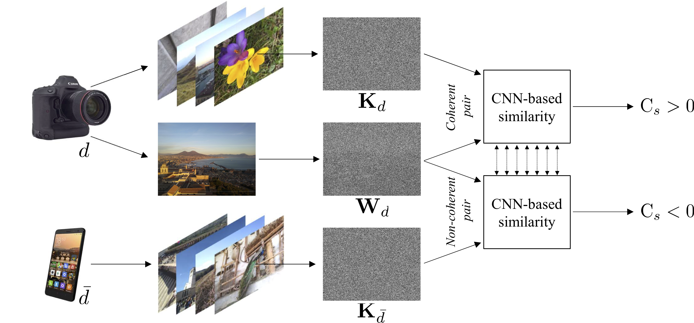

# CNN-based fast source device identification


This is the official repository of **CNN-based fast source device identification**,
accepted to [IEEE SIGNAL PROCESSING LETTERS](https://ieeexplore.ieee.org/xpl/RecentIssue.jsp?punumber=97), VOL. 27, 2020 and currently available on [arXiv](https://arxiv.org/pdf/2001.11847.pdf).


## Code

### Prerequisites

- Install conda
- Create the `cnn_fast_sdi` environment with `environment.yml`
```bash
$ conda env create -f environment.yml
$ conda activate cnn_fast_sdi
```
### Quick results
If you just want to visualize results of our pre-trained models and tested over all the 87 devices in the dataset:
- [notebook showing the results](show_results.ipynb)
- You can find the complete list of results for every model [here](outputs/)

### Extract image noise residuals and device PRNU and save them 
You can extract them using the Python implementation available [here](https://github.com/polimi-ispl/prnu-python).  
For each device, create a train-validation-test split, dividing the image noise residuals in 50% training, 25% validation, 25% evaluation.  
Create 3 lists for each device reporting the paths to the noise residuals: 
- `/Noises_lists/train/list_%device_name.npy`
- `/Noises_lists/valid/list_%device_name.npy`
- `/Noises_lists/test/list_%device_name.npy`

### Train

Run `[train_cnn.py](train_cnn.py)` to train a CNN for image-PRNU matching. 
Please refer to the comments in the script for hints on the usage.
For instance, to train the PCN architecture on image-patches of 224 x 224 pixels, you can run:

```bash
$ python3 train_cnn.py --model_dir ./models/Pcn_crop224 --crop_size 224 --base_network Pcn
```

### Test

Run `[test_cnn.py](test_cnn.py)` to test a CNN for image-PRNU matching. 
Please refer to the comments in the script for hints on the usage.
For instance, to test the PCN architecture on image-patches of 224 x 224 pixels, you can run:

```bash
$ python3 test_cnn.py --model_dir ./models/Pcn_crop224 --output_file ./outputs/Pcn_crop224_test.npz--crop_size 224 --base_network Pcn
```
## Supplementary materials
In [supplementary_materials](supplementary_materials) you can find more detailed results. Precisely, [supplementary_materials.pdf](supplementary_materials/supplementary_materials.pdf) reports the list of results for the closed-set problem, i.e., identifying the image source among a finite pool of devices, and for the open-set problem, i.e., tackling source identification in case of unknown cameras. MATLAB .fig files used to generate these results are reported as well.

## Credits
[ISPL: Image and Sound Processing Lab - Politecnico di Milano](http://ispl.deib.polimi.it/)
- Sara Mandelli (sara.mandelli@polimi.it)
- Paolo Bestagini (paolo.bestagini@polimi.it) 

[GRIP: Image Processing Research Group - University Federico II of Naples](http://www.grip.unina.it/)
- Davide Cozzolino (davide.cozzolino@unina.it)
- Luisa Verdoliva (verdoliv@unina.it)
